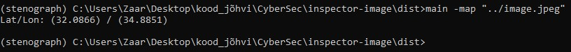
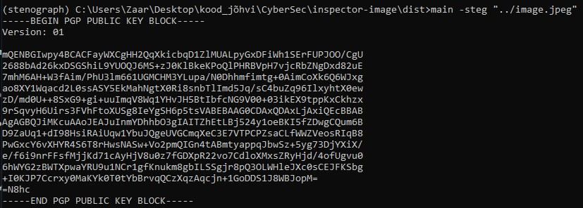

# Inspector Image

## Table of Contents

- [HowToRun](#howtorun)
- [Audit](#audit)
- [Screenshots](#screenshots)
- [Contributing](#contributing)
- [License](#license)
- [Contact](#contact)
- [Authors](#authors)

## How to Run

```python
Have python installed
git clone project
cd project
pip install -r requirements.txt # installs dependencies
pyinstaller --onefile main.py # compiles the sourcecode into an exe
cd dist # compiled exe is here
```

## Project Description

This project is made to check pictures for hidden PGP data.

```python
-map "image/location" # fetches metadata from the picture and shows the longitude and latitude of where the picture was taken.

#example:
-map "image.jpeg"
```

```python
main -steg "image/location" # tries to fetch PGP data from the image provided and show it in the terminal.

#example:
main -steg "image.jpeg"
```

## Audit

To audit the program, follow the steps [here](https://github.com/01-edu/public/tree/master/subjects/cybersecurity/inspector-image/audit).

## Project Screenshots

Here's Images of the project:




## Contributing

We welcome contributions! Please contact one of the authors in discord if you would like to contribute to future projects.

## License

This project is licensed under the MIT License. See the [LICENSE](https://opensource.org/license/mit) file for details.

## Contact

For any questions or suggestions, feel free to contact us directly at `Kood / Jõhvi Discord`.

## Authors

_Authors: [Jaanus Saar](https://01.kood.tech/git/jsaar), [Oliver Vilu](https://01.kood.tech/git/ovilu)_
